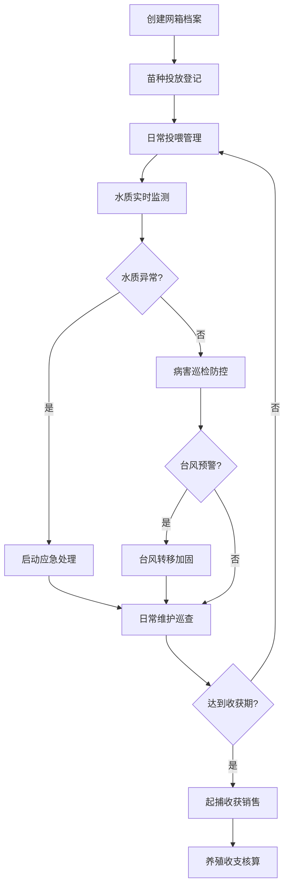
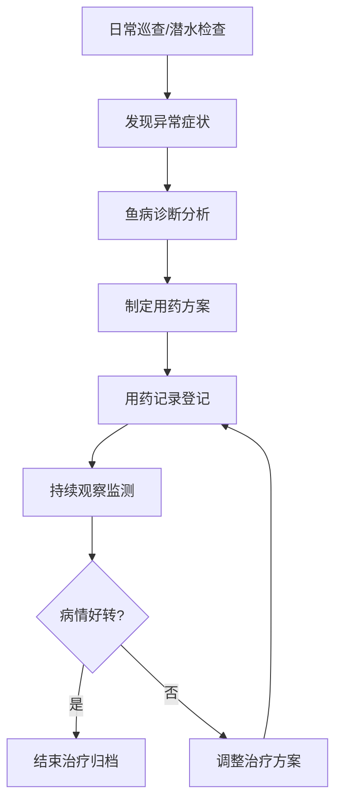

## 1. 产品概述

海洋牧场网箱养殖管理系统是一款面向水产养殖企业的专业管理软件，通过信息化手段实现网箱养殖全流程管理，解决传统养殖模式中数据分散、管理粗放、风险预警滞后等问题，帮助企业提升养殖效率、降低运营风险、提高经济效益。

- 面向海洋水产养殖企业、渔业合作社及大型养殖基地
- 覆盖从苗种投放到收获销售的完整养殖周期管理
- 集成水质监测、病害防控、灾害预警等智能化功能

## 2. 核心功能

### 2.1 用户角色

| 角色 | 注册方式 | 核心权限 |
|------|----------|----------|
| 系统管理员 | 企业内部创建 | 系统配置、用户管理、数据备份、权限分配 |
| 养殖主管 | 管理员创建 | 全模块操作、数据查看、报表统计、决策审批 |
| 养殖员 | 管理员创建 | 数据录入、日常巡检、投喂操作、设备维护 |
| 财务人员 | 管理员创建 | 收支管理、销售记录、成本核算、财务报表 |

### 2.2 功能模块

1. **网箱台账**：网箱位置档案管理，记录网箱基本信息、位置坐标、规格参数、使用状态
2. **苗种投放**：鱼苗投放登记，记录投放时间、苗种信息、投放数量、网箱分配
3. **投喂管理**：自动投喂排期，设置投喂计划、投喂量统计、投喂设备监控
4. **水质监测**：溶氧盐度监测、水温pH监测、水质数据图表、赤潮预警
5. **病害防控**：鱼病诊断用药、网衣破损检查、潜水巡查记录、病害防治档案
6. **台风防御**：台风转移加固、台风预警、应急方案、加固记录
7. **收获销售**：起捕收获登记、活鱼运输管理、养殖收支统计、销售数据分析

### 2.3 页面详情

| 页面名称 | 模块名称 | 功能描述 |
|----------|----------|----------|
| 工作台 | 总览面板 | 关键指标展示、待办事项、数据概览卡片、快捷操作入口 |
| 网箱台账 | 网箱位置档案 | 网箱列表、网箱详情、位置地图、规格参数、状态管理、设备绑定 |
| 苗种投放 | 鱼苗投放登记 | 投放计划、投放记录、苗种信息、数量统计、网箱分配、批次追踪 |
| 投喂管理 | 自动投喂排期 | 投喂计划、投喂日历、投喂设备、投喂量统计、投喂历史记录 |
| 水质监测 | 溶氧盐度监测 | 实时监测数据、历史趋势图表、水质指标、赤潮预警、报警记录 |
| 病害防控 | 鱼病诊断用药 | 鱼病诊断、用药记录、网衣破损检查、潜水巡查、病害预警、防治档案 |
| 台风防御 | 台风转移加固 | 台风预警、应急预案、加固记录、转移调度、灾害损失评估 |
| 收获销售 | 起捕收获 | 收获计划、起捕记录、产量统计、活鱼运输、质量追溯 |
| 财务管理 | 养殖收支 | 成本记录、销售记录、收支明细、利润分析、财务报表 |
| 系统设置 | 系统管理 | 用户管理、角色权限、数据字典、系统配置、日志审计 |

## 3. 核心流程

### 3.1 养殖管理主流程

### 3.2 病害防控流程

## 4. 用户界面设计

### 4.1 设计风格

- **主色调**：深海蓝 (#0E4D7A)，代表专业、可信赖，契合海洋主题
- **辅助色**：海洋青 (#20B2AA) 用于强调和交互元素；警示橙 (#FF7F50) 用于预警提示；成功绿 (#3CB371) 用于正常状态
- **背景色**：浅灰蓝 (#F0F8FF) 作为页面背景，营造清爽专业的氛围
- **按钮样式**：圆角矩形按钮，带有微妙的渐变效果和阴影，hover时有轻微上浮动画
- **字体**：标题使用 "Noto Sans SC" 字体，正文使用系统无衬线字体，层级清晰
- **布局风格**：左侧导航栏 + 顶部状态栏 + 右侧内容区的经典企业级应用布局，卡片式内容展示
- **图标风格**：线性图标配合填充图标，使用海洋相关元素（鱼、波浪、网箱等）增强主题感

### 4.2 页面设计概览

| 页面名称 | 模块名称 | UI元素 |
|----------|----------|--------|
| 工作台 | 总览面板 | 数据卡片网格、折线图/柱状图可视化、待办事项列表、快捷操作按钮、轮播通知 |
| 网箱台账 | 网箱档案 | 地图组件展示网箱分布、数据表格、筛选搜索栏、详情侧边栏、状态标签 |
| 投喂管理 | 投喂排期 | 日历视图、时间轴展示、设备状态指示器、投喂量统计图表、计划配置表单 |
| 水质监测 | 监测面板 | 实时数据仪表盘、多维度趋势图表、报警通知中心、阈值配置、预警动画效果 |
| 病害防控 | 病害管理 | 症状选择器、诊断结果展示、用药记录表格、检查记录时间线、健康状态评分 |
| 台风防御 | 台风管理 | 台风路径图、预警等级指示器、应急预案卡片、加固进度条、转移调度表 |
| 收获销售 | 收获管理 | 收获进度追踪、产量统计图表、运输状态地图、二维码追溯标识 |
| 财务管理 | 收支管理 | 收支流水表格、利润分析图表、成本构成饼图、财务报表导出 |

### 4.3 响应式设计

- **桌面优先**：针对1920×1080及以上分辨率优化，侧边栏固定宽度240px
- **平板适配**：1024px及以上，侧边栏可折叠为图标模式
- **移动端**：768px以下，顶部导航汉堡菜单，底部Tab切换，表格组件支持横向滚动
- **触摸优化**：按钮最小高度44px，表单元素间距适中，支持下拉刷新和上拉加载

### 4.4 数据可视化设计

- 实时数据采用仪表盘样式，带有动态数值变化效果
- 趋势图表使用平滑曲线，支持多指标叠加对比
- 预警数据使用醒目的颜色区分，带有闪烁提示动画
- 地图组件支持网箱位置标记，点击显示详情气泡
