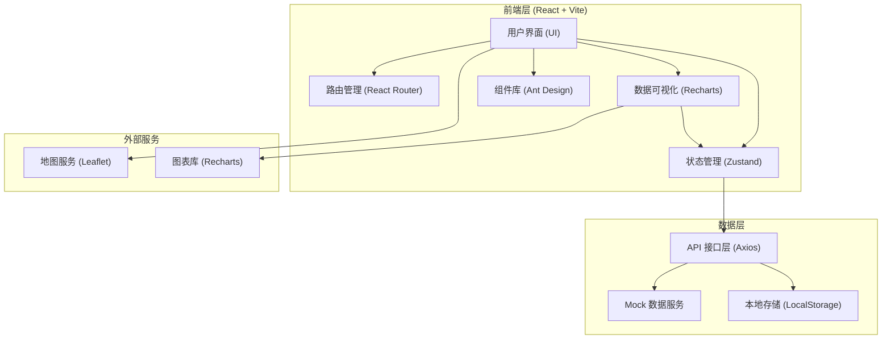

## 1. 架构设计



## 2. 技术描述

- **前端框架**: React@18 + TypeScript@5
- **构建工具**: Vite@5
- **状态管理**: Zustand@4
- **路由管理**: React Router@6
- **UI组件库**: Ant Design@5
- **样式方案**: Tailwind CSS@3 + CSS Variables
- **图表库**: Recharts@2
- **地图组件**: Leaflet@1.9
- **HTTP客户端**: Axios@1.6
- **图标库**: Lucide React
- **日期处理**: Day.js
- **表单验证**: React Hook Form + Zod

## 3. 目录结构

```
src/
├── assets/              # 静态资源
│   ├── images/
│   └── styles/
├── components/          # 公共组件
│   ├── layout/         # 布局组件
│   ├── common/         # 通用组件
│   └── charts/         # 图表组件
├── pages/              # 页面组件
│   ├── dashboard/      # 工作台
│   ├── cage/           # 网箱台账
│   ├── fry/            # 苗种投放
│   ├── feeding/        # 投喂管理
│   ├── water/          # 水质监测
│   ├── disease/        # 病害防控
│   ├── typhoon/        # 台风防御
│   ├── harvest/        # 收获销售
│   ├── finance/        # 财务管理
│   └── settings/       # 系统设置
├── store/              # 状态管理
├── hooks/              # 自定义Hooks
├── services/           # API服务
├── mock/               # Mock数据
├── types/              # TypeScript类型定义
├── utils/              # 工具函数
├── router/             # 路由配置
├── App.tsx
└── main.tsx
```

## 4. 路由定义

| 路由路径 | 页面名称 | 模块归属 |
|----------|----------|----------|
| `/` | 工作台总览 | 工作台 |
| `/cage` | 网箱台账列表 | 网箱台账 |
| `/cage/:id` | 网箱详情 | 网箱台账 |
| `/fry` | 苗种投放记录 | 苗种投放 |
| `/fry/new` | 新增投放登记 | 苗种投放 |
| `/feeding` | 投喂管理首页 | 投喂管理 |
| `/feeding/schedule` | 投喂排期日历 | 投喂管理 |
| `/water` | 水质监测面板 | 水质监测 |
| `/water/alerts` | 赤潮预警中心 | 水质监测 |
| `/disease` | 病害防控首页 | 病害防控 |
| `/disease/diagnosis` | 鱼病诊断 | 病害防控 |
| `/disease/inspection` | 潜水巡查 | 病害防控 |
| `/disease/net-check` | 网衣破损检查 | 病害防控 |
| `/typhoon` | 台风防御首页 | 台风防御 |
| `/typhoon/plan` | 应急预案 | 台风防御 |
| `/harvest` | 收获管理首页 | 收获销售 |
| `/harvest/transport` | 活鱼运输 | 收获销售 |
| `/finance` | 养殖收支 | 财务管理 |
| `/settings` | 系统设置 | 系统设置 |
| `/settings/users` | 用户管理 | 系统设置 |

## 5. 数据模型

### 5.1 实体关系图

```mermaid
erDiagram
    CAGE ||--o{ FRY_RELEASE : contains
    CAGE ||--o{ FEEDING_RECORD : has
    CAGE ||--o{ WATER_QUALITY : monitors
    CAGE ||--o{ DISEASE_RECORD : has
    CAGE ||--o{ INSPECTION : has
    CAGE ||--o{ HARVEST : produces
    FRY_RELEASE ||--o{ FEEDING_RECORD : relates
    FRY_RELEASE ||--o{ HARVEST : produces
    TYPHOON ||--o{ REINFORCEMENT : triggers
    TYPHOON ||--o{ CAGE_TRANSFER : triggers
    HARVEST ||--o{ TRANSPORT : ships
    HARVEST ||--o{ FINANCE_RECORD : generates
    FEEDING_RECORD ||--o{ FINANCE_RECORD : generates

    CAGE {
        string id PK
        string code
        string name
        decimal latitude
        decimal longitude
        string specification
        string material
        date install_date
        string status
        string equipment
    }

    FRY_RELEASE {
        string id PK
        string cage_id FK
        string fry_species
        int quantity
        decimal weight
        date release_date
        string batch_no
        string supplier
    }

    FEEDING_RECORD {
        string id PK
        string cage_id FK
        string fry_release_id FK
        date feeding_date
        time feeding_time
        string feed_type
        decimal feed_amount
        string feeder
        string device_id
    }

    WATER_QUALITY {
        string id PK
        string cage_id FK
        datetime measure_time
        decimal dissolved_oxygen
        decimal salinity
        decimal temperature
        decimal ph_value
        decimal ammonia_nitrogen
        string warning_level
    }

    DISEASE_RECORD {
        string id PK
        string cage_id FK
        date发现_date
        string symptoms
        string diagnosis
        string treatment
        string medicine
        date recovery_date
        string status
    }

    INSPECTION {
        string id PK
        string cage_id FK
        string type
        date inspection_date
        string inspector
        string findings
        string photos
        string status
    }

    TYPHOON {
        string id PK
        string name
        string level
        datetime landfall_time
        string path
        string warning_level
    }

    REINFORCEMENT {
        string id PK
        string typhoon_id FK
        string cage_id FK
        date reinforcement_date
        string measures
        string operator
        string status
    }

    HARVEST {
        string id PK
        string cage_id FK
        string fry_release_id FK
        date harvest_date
        decimal quantity
        decimal weight
        string quality_grade
        string buyer
    }

    TRANSPORT {
        string id PK
        string harvest_id FK
        date departure_date
        string destination
        string vehicle
        string driver
        decimal temperature
        datetime arrival_time
        string status
    }

    FINANCE_RECORD {
        string id PK
        string type
        string related_id FK
        date transaction_date
        decimal amount
        string category
        string description
    }
```

### 5.2 核心数据类型定义

```typescript
// 网箱信息
interface Cage {
  id: string;
  code: string;
  name: string;
  latitude: number;
  longitude: number;
  specification: string;
  material: string;
  installDate: string;
  status: 'normal' | 'maintenance' | 'damaged' | 'idle';
  equipment: string[];
}

// 苗种投放记录
interface FryRelease {
  id: string;
  cageId: string;
  frySpecies: string;
  quantity: number;
  weight: number;
  releaseDate: string;
  batchNo: string;
  supplier: string;
}

// 投喂记录
interface FeedingRecord {
  id: string;
  cageId: string;
  fryReleaseId: string;
  feedingDate: string;
  feedingTime: string;
  feedType: string;
  feedAmount: number;
  feeder: string;
  deviceId: string;
}

// 水质监测数据
interface WaterQuality {
  id: string;
  cageId: string;
  measureTime: string;
  dissolvedOxygen: number;
  salinity: number;
  temperature: number;
  phValue: number;
  ammoniaNitrogen: number;
  warningLevel: 'normal' | 'warning' | 'danger';
}

// 病害记录
interface DiseaseRecord {
  id: string;
  cageId: string;
  foundDate: string;
  symptoms: string[];
  diagnosis: string;
  treatment: string;
  medicine: string;
  recoveryDate?: string;
  status: 'diagnosed' | 'treating' | 'recovered' | 'dead';
}

// 巡查记录
interface Inspection {
  id: string;
  cageId: string;
  type: 'diving' | 'net_check' | 'routine';
  inspectionDate: string;
  inspector: string;
  findings: string;
  photos: string[];
  status: 'normal' | 'issue_found' | 'resolved';
}

// 收获记录
interface Harvest {
  id: string;
  cageId: string;
  fryReleaseId: string;
  harvestDate: string;
  quantity: number;
  weight: number;
  qualityGrade: string;
  buyer: string;
}

// 运输记录
interface Transport {
  id: string;
  harvestId: string;
  departureDate: string;
  destination: string;
  vehicle: string;
  driver: string;
  temperature: number;
  arrivalTime?: string;
  status: 'pending' | 'transporting' | 'arrived' | 'delayed';
}

// 财务记录
interface FinanceRecord {
  id: string;
  type: 'income' | 'expense';
  relatedId: string;
  transactionDate: string;
  amount: number;
  category: string;
  description: string;
}
```

### 5.3 Mock数据说明

系统使用Mock数据模拟后端服务，主要包括：
- 预置20个网箱数据，包含不同规格和状态
- 近6个月的苗种投放记录
- 近3个月的投喂记录（按每日3次模拟）
- 每小时更新的水质监测历史数据
- 病害、巡查、收获、运输、财务等业务数据

所有Mock数据存储在 `src/mock/` 目录下，按模块分类管理。
